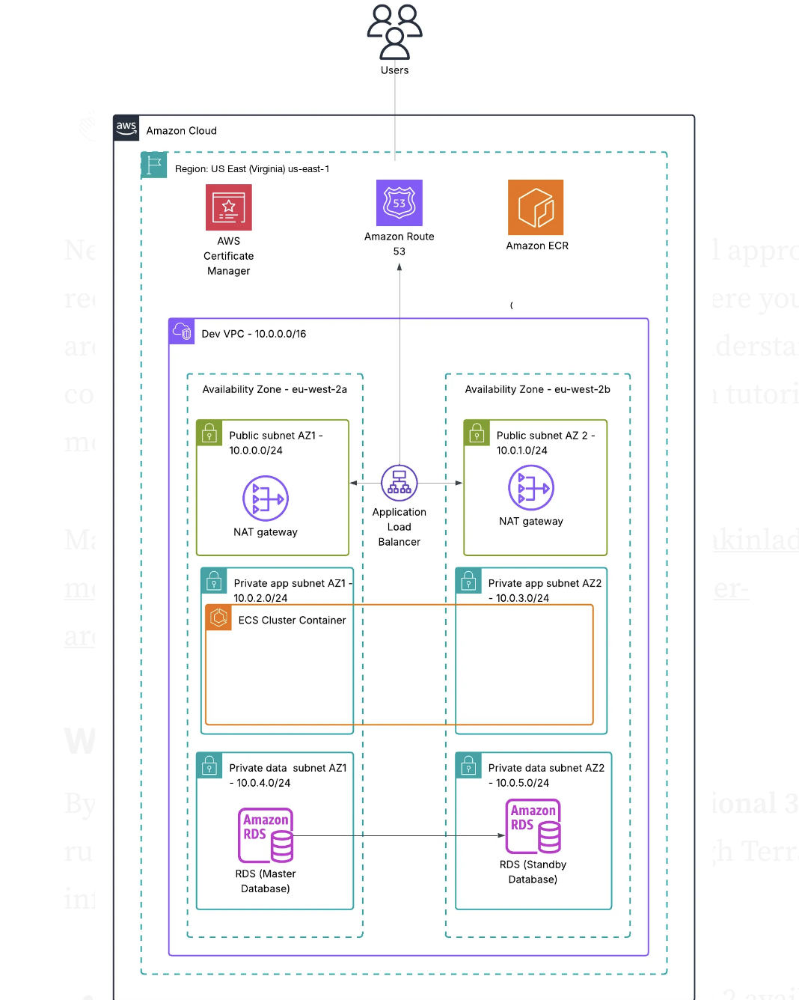

# Automating AWS ECS Deployment —Infrastructure as Code with Terraform
This repository provides a complete Terraform configuration to automate the deployment of a containerized application on AWS ECS Fargate. The infrastructure includes VPC, subnets, security groups, load balancer, ECS cluster, task definitions, and optional Route 53 DNS setup.

## Architecture Diagram

## Pre-requisites

Before starting, ensure you have:

- AWS CLI installed and configured (aws configure)
- Terraform installed (version 1.0+)
- Docker installed locally (to pull and push images)
- Basic understanding of AWS services
- AWS account with appropriate permissions
- Optional: A domain name (for SSL setup)

