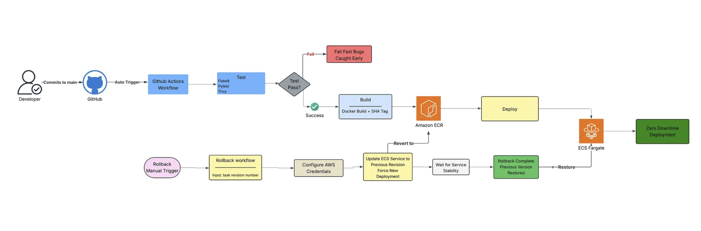

# AWS ECS Fargate Deployment with Terraform

Fully automated, production-ready Infrastructure as Code for deploying a containerized Flask application on AWS Elastic Container Service (ECS) Fargate. Includes a complete CI/CD pipeline via GitHub Actions with OIDC authentication — no long-lived AWS credentials stored anywhere.

## Architecture Diagram


## CI/CD Pipeline



---

## Application

A multi-user **Student Attendance Tracking System** built with Flask and PostgreSQL. Features include:

- User registration and authentication (bcrypt password hashing)
- Student management (add, edit, delete)
- Attendance marking and reporting
- Class session management
- Prometheus metrics endpoint (`/metrics`)
- Structured JSON logging
- Health check endpoint (`/login`)

---

## Infrastructure Overview

| Component | Service | Details |
|---|---|---|
| Compute | AWS ECS Fargate | Serverless containers, 2 tasks across 2 AZs |
| Container Registry | Amazon ECR | Image scanning on push, lifecycle policy (last 10 images) |
| Database | Amazon RDS PostgreSQL 15 | `db.t3.micro`, encrypted, 7-day backups, auto-scaling storage (20–100 GB) |
| Networking | VPC | `/16` CIDR, public + private subnets across 2 AZs |
| Load Balancing | Application Load Balancer | Public-facing, HTTP→HTTPS redirect (with custom domain) |
| DNS & TLS | Route 53 + ACM | Optional custom domain with auto-validated SSL certificate |
| State Management | S3 + DynamoDB | Remote Terraform state with locking |
| Monitoring | CloudWatch | Container Insights, log groups (7-day retention) |
| Security | IAM + Security Groups | Least-privilege roles, OIDC-based GitHub Actions auth |

### Network Design

```
Internet
    │
    ▼
[ ALB ] ── Public Subnets (us-east-1a, us-east-1b)
    │
    ▼
[ ECS Fargate Tasks ] ── Private App Subnets
    │                         │
    │                    [ NAT Gateway ] ──► Internet (outbound)
    ▼
[ RDS PostgreSQL ] ── Private DB Subnets (isolated)
```

---

## Repository Structure

```
.
├── .github/
│   └── workflows/
│       ├── deploy.yml              # Build, scan & deploy app to ECS
│       ├── terraform-apply.yml     # Provision/update infrastructure
│       ├── terraform-destroy.yml   # Tear down all resources (manual, gated)
│       └── rollback.yml            # Roll back ECS to a previous task revision
├── files/
│   ├── Dockerfile                  # Application container image
│   ├── Docker-compose.yml          # Local development environment
│   ├── requirements.txt            # Python dependencies
│   ├── config.py                   # Flask configuration
│   ├── run.py                      # Application entry point
│   └── app/
│       ├── __init__.py             # App factory, middleware, metrics
│       ├── logging_config.py       # Structured JSON logging
│       ├── metrics.py              # Prometheus counters and histograms
│       ├── models/                 # SQLAlchemy ORM models
│       ├── routes/                 # Flask blueprints (auth, main routes)
│       ├── templates/              # Jinja2 HTML templates
│       └── static/                 # CSS assets
├── terraform/
│   ├── backend.tf                  # S3 remote state + DynamoDB lock
│   ├── variables.tf                # Input variable definitions
│   ├── outputs.tf                  # Useful post-deploy outputs
│   ├── main.tf                     # Provider config and local values
│   ├── vpc.tf                      # VPC, subnets, IGW, NAT Gateway
│   ├── security-groups.tf          # ALB, ECS, RDS security groups
│   ├── alb.tf                      # Application Load Balancer
│   ├── ecs.tf                      # ECR, ECS cluster, task definition, service
│   ├── rds.tf                      # PostgreSQL RDS instance
│   ├── acm.tf                      # ACM certificate (optional)
│   ├── route53.tf                  # DNS record (optional)
│   └── terraform.tfvars            # Local variable overrides (gitignored)
├── images/
│   ├── architecture-diagram.png
│   ├── CICD-pipeline.png
│   └── setup-guide.md              # Detailed bootstrap guide
├── github-oidc-trust-policy.json   # IAM trust policy for GitHub OIDC
└── github-actions-permissions.json # IAM permissions policy for GitHub Actions
```

---

## Prerequisites

- **AWS account** with permissions to create IAM, VPC, ECS, RDS, ECR, S3, and DynamoDB resources
- **AWS CLI** v2 installed and configured
- **Terraform** >= 1.6
- **Docker** (for local development)
- **GitHub repository** with Actions enabled

---

## Quick Start

### 1 — Bootstrap Terraform Remote State

Create the S3 bucket and DynamoDB table that store Terraform state **before** running any workflow:

```bash
# Create S3 bucket (versioning + encryption)
aws s3api create-bucket \
  --bucket attendance-app-bkt \
  --region us-east-1

aws s3api put-bucket-versioning \
  --bucket attendance-app-bkt \
  --versioning-configuration Status=Enabled

aws s3api put-bucket-encryption \
  --bucket attendance-app-bkt \
  --server-side-encryption-configuration \
    '{"Rules":[{"ApplyServerSideEncryptionByDefault":{"SSEAlgorithm":"AES256"}}]}'

# Create DynamoDB table for state locking
aws dynamodb create-table \
  --table-name attendance-app-terraform-state-lock \
  --attribute-definitions AttributeName=LockID,AttributeType=S \
  --key-schema AttributeName=LockID,KeyType=HASH \
  --billing-mode PAY_PER_REQUEST \
  --region us-east-1
```

### 2 — Set Up GitHub Actions OIDC Authentication

This project uses **OIDC federation** — GitHub Actions assumes an AWS IAM role directly. No access keys are stored as secrets.

```bash
# Create the OIDC identity provider (one-time per AWS account)
# Skip this if it already exists — only one provider per account is needed
aws iam create-open-id-connect-provider \
  --url https://token.actions.githubusercontent.com \
  --client-id-list sts.amazonaws.com \
  --thumbprint-list 6938fd4d98bab03faadb97b34396831e3780aea1
```

> If you get `EntityAlreadyExists`, the provider is already set up in your account — skip to creating the role below.

```bash
# Get the OIDC provider ARN (needed for the trust policy)
aws iam list-open-id-connect-providers

# Edit github-oidc-trust-policy.json to replace YOUR_GITHUB_ORG/YOUR_REPO
# with your actual GitHub repository path, then create the role
aws iam create-role \
  --role-name GitHubActionsECSRole \
  --assume-role-policy-document file://github-oidc-trust-policy.json

# Attach AdministratorAccess for a dev/POC setup (simplest, avoids permission gaps)
aws iam attach-role-policy \
  --role-name GitHubActionsECSRole \
  --policy-arn arn:aws:iam::aws:policy/AdministratorAccess
```

> For a production setup, replace `AdministratorAccess` with the scoped policy in `github-actions-permissions.json` using `aws iam put-role-policy`.

### 3 — Configure GitHub Secrets and Variables

Navigate to **Settings → Secrets and variables → Actions** in your GitHub repository.

> `terraform.tfvars` is gitignored and never used by GitHub Actions. All variable values are passed as `-var` flags directly in the workflow — sensitive ones via Secrets, optional ones via Variables.

**Secrets** — required, go to the **Secrets** tab (values are encrypted and never shown in logs):

| Secret | Example Value | Notes |
|---|---|---|
| `AWS_ROLE_ARN` | `arn:aws:iam::123456789012:role/GitHubActionsECSRole` | ARN of the IAM role created in Step 2 |
| `TF_STATE_BUCKET` | `attendance-app-bkt` | S3 bucket created in Step 1 |
| `DB_USERNAME` | `dbadmin` | RDS master username |
| `DB_PASSWORD` | `MySecurePass123!` | RDS master password (min 8 chars) |

**Secrets (continued)** — optional, add these to the **Secrets** tab if using a custom domain + HTTPS:

| Secret | Example Value | Default if not set |
|---|---|---|
| `DOMAIN_NAME` | `attendance-app.cojocloudsolutions.com` | `""` — deploys HTTP only via ALB DNS |
| `ROUTE53_ZONE_NAME` | `cojocloudsolutions.com` | `""` |
| `CREATE_ROUTE53_RECORD` | `true` | `false` |

> If you skip the domain secrets, the app deploys over HTTP and is accessible via the ALB DNS name printed in the workflow summary. All other Terraform variables (`aws_region`, `vpc_cidr`, `desired_count`, etc.) already have defaults in `variables.tf` and do not need to be set anywhere.

### 4 — Deploy Infrastructure

Push any change to `terraform/` or trigger manually:

```
GitHub Actions → Terraform Apply workflow → runs on push to main (terraform/**)
```

Or run locally:

```bash
cd terraform
terraform init \
  -backend-config="bucket=attendance-app-bkt" \
  -backend-config="key=attendance-app/terraform.tfstate" \
  -backend-config="region=us-east-1"

terraform plan -var="db_username=dbadmin" -var="db_password=YourSecurePassword"
terraform apply
```

### 5 — Deploy the Application

Push any change to `files/app/**`, `files/Dockerfile`, or `files/requirements.txt`:

```
GitHub Actions → Build & Deploy workflow → test → security scan → build & push to ECR → update ECS service
```

The workflow:
1. Runs Flake8 linting
2. Scans the Docker image with **Trivy** for known CVEs
3. Builds and pushes the image tagged with the Git commit SHA and `latest`
4. Updates the ECS task definition and triggers a rolling deployment
5. Waits for the service to stabilize before reporting success

---

## CI/CD Workflows

### `deploy.yml` — App Deployment
**Trigger:** Push to `main` with changes in `files/`

```
test → security-scan → build-and-deploy
```

- Python unit tests + Flake8
- Trivy container vulnerability scan
- Docker build → ECR push (SHA tag + latest)
- ECS task definition update + rolling deploy

### `terraform-apply.yml` — Infrastructure Changes
**Trigger:** Push to `main` with changes in `terraform/` or manual dispatch

- Terraform init → plan → apply
- Job summary shows ALB DNS and custom domain URL (if configured)

### `terraform-destroy.yml` — Tear Down
**Trigger:** Manual only — requires typing `destroy` to confirm

Destroys all AWS resources. Use before closing the project to avoid ongoing costs.
All secrets are sourced from GitHub Secrets — no hardcoded values.

### `rollback.yml` — Emergency Rollback
**Trigger:** Manual — provide a task definition revision number

```bash
# Example: roll back to task definition revision 5
# Trigger via GitHub UI: Actions → Rollback → Run workflow → revision: 5
```

---

## Local Development

```bash
cd files

# Start app + PostgreSQL with Docker Compose
docker compose up -d

# App available at http://localhost:8000
# Default: register a new user on first run
```

---

## Terraform Outputs

After `terraform apply`, key outputs include:

| Output | Description |
|---|---|
| `alb_dns_name` | ALB public DNS hostname |
| `application_url` | Full app URL (custom domain if configured) |
| `ecr_repository_url` | ECR repo URL for Docker push |
| `ecs_cluster_name` | ECS cluster name |
| `rds_endpoint` | PostgreSQL connection endpoint |
| `ecr_push_commands` | Ready-to-run Docker push commands |

---

## Security Design

- **No long-lived credentials** — GitHub Actions uses OIDC to assume an IAM role scoped to this repository
- **Least-privilege IAM** — separate execution role (ECR/CloudWatch access) and task role (application permissions)
- **Secrets Manager ready** — DB credentials are passed as environment variables; upgrade path to Secrets Manager is straightforward
- **Private networking** — ECS tasks and RDS are in private subnets; only the ALB is public-facing
- **Encrypted at rest** — RDS and ECR use AES-256 encryption; S3 state bucket uses SSE
- **Image scanning** — ECR scans every pushed image for CVEs; Trivy scans at build time in CI
- **`terraform.tfvars` gitignored** — sensitive local variable files are excluded via `.gitignore`

---

## Cost Estimate (us-east-1, dev workload)

| Resource | Approx. Monthly Cost |
|---|---|
| ECS Fargate (2× 0.25 vCPU / 512 MB) | ~$15 |
| RDS PostgreSQL `db.t3.micro` | ~$15 |
| NAT Gateway | ~$35 |
| ALB | ~$20 |
| **Total** | **~$85/month** |

> Destroy resources when not in use with the `terraform-destroy.yml` workflow.

---

## Cleanup

Trigger the **Terraform Destroy** workflow from GitHub Actions (type `destroy` to confirm) or run:

```bash
cd terraform
terraform destroy \
  -var="db_username=dbadmin" \
  -var="db_password=YourSecurePassword"
```

---

## Troubleshooting

**ECS tasks failing health checks**
- Health check path is `/login`. Ensure the app is fully initialised within 300 seconds (grace period).
- Check CloudWatch logs: `/ecs/attendance-app-dev`

**Terraform backend access denied (S3 403)**
- Ensure the IAM role has `s3:ListBucket` and `s3:GetObject/PutObject` on the state bucket.
- For a quick fix on a dev setup, attach `AdministratorAccess` to the role (see Step 2).

**OIDC provider already exists**
- `EntityAlreadyExists` when creating the OIDC provider is not an error — the provider is shared across the AWS account. Skip that step and proceed to creating the IAM role.

**OIDC authentication failing**
- Verify the trust policy in `github-oidc-trust-policy.json` matches your exact GitHub org/repo name and branch.
- Confirm `id-token: write` permission is set in the workflow.

**Custom domain not accessible / HTTPS not working**
- Check ACM certificate status: must be `ISSUED` before HTTPS works.
- Verify your domain registrar's nameservers match the Route 53 hosted zone nameservers.
- Test DNS propagation: `nslookup attendance-app.cojocloudsolutions.com 8.8.8.8`
- Allow up to 60 minutes for DNS propagation after the Route 53 record is created.

**ECR push denied**
- Ensure `AdministratorAccess` or the scoped policy in `github-actions-permissions.json` is attached to the GitHub Actions IAM role.
